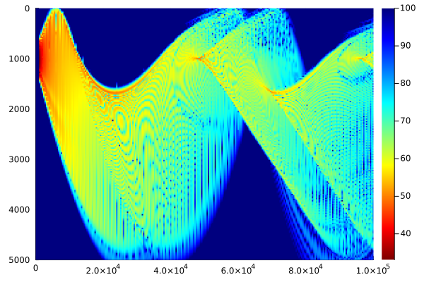
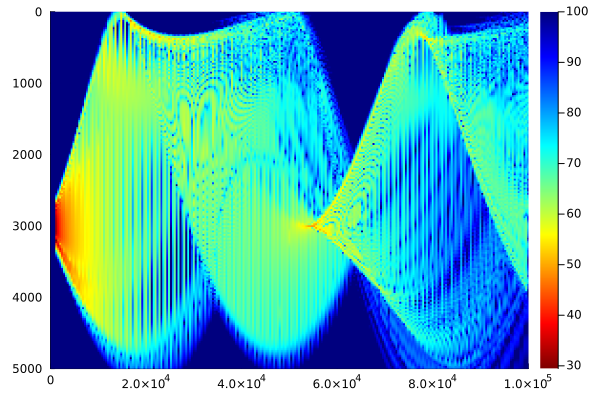
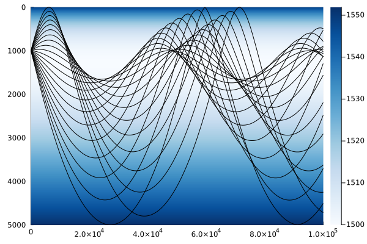
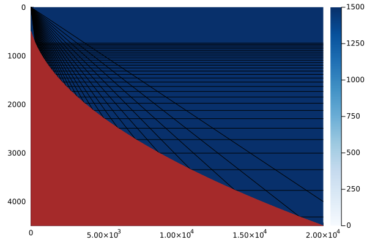
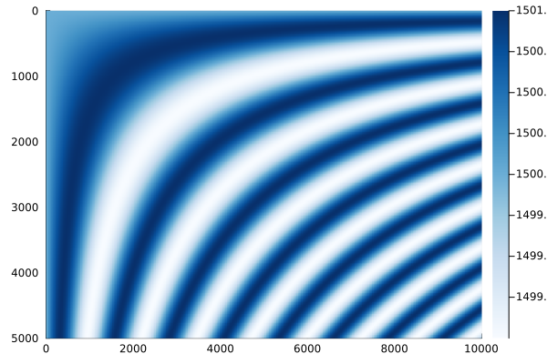

# OceanSonar

[](https://kapple19.github.io/OceanSonar.jl/stable/)
[](https://kapple19.github.io/OceanSonar.jl/dev/)
[](https://github.com/kapple19/OceanSonar.jl/actions/workflows/CI.yml?query=branch%3Amain)
[](https://github.com/JuliaTesting/Aqua.jl)

[ModelingToolkit.jl]: https://docs.sciml.ai/ModelingToolkit/stable/
[Plots.jl]: https://docs.juliaplots.org/stable/
[Symbolics.jl]: https://docs.sciml.ai/Symbolics/stable/

This package is in development.

## Features

Built-in, flexible visualisation with [Plots.jl] backend

```julia
using OceanSonar
using Plots

scen = Scenario("Munk Profile")
prop = Propagation("Trace", scen, angles = critical_angles(scen))
visual(prop)
```



Conceptually-structured hierarchical containers

```julia
using OceanSonar

env = Environment("Munk Profile")

env.ocn # Ocean medium data container
env.sbd # Seabed medium data container
env.atm # Atmosphere medium data container

env.ocn.cel # Ocean sound speed ("celerity") profile as bivariate functor
env.sbd.den # Seabed density profile as bivariate functor
env.atm.wnd # Atmosphere wind profile as bivariate functor (WIP)
```

Mathematical introspection via [Symbolics.jl]
and visualisation of equations via [Latexify.jl]

```julia
using OceanSonar
using Symbolics
using Latexify

@variables x z

c_eqn = ocean_celerity("Munk", x, z)

c_eqn |> latexify |> render
```


Compiler introspection

```julia
@code_native bathymetry("Parabolic", 0)
```

```verbatim
        .text
        .file   "bathymetry"
        .globl  julia_bathymetry_4889           # -- Begin function julia_bathymetry_4889
        .p2align        4, 0x90
        .type   julia_bathymetry_4889,@function
julia_bathymetry_4889:                  # @julia_bathymetry_4889
; ┌ @ c:\Users\Aaron\.julia\dev\OceanSonar\src\auxiliary\modelling.jl:141 within `bathymetry`
        .cfi_startproc
# %bb.0:                                # %top
        push    rbp
        .cfi_def_cfa_offset 16
        .cfi_offset rbp, -16
        mov     rbp, rsp
        .cfi_def_cfa_register rbp
        sub     rsp, 32
        movabs  rax, offset "j_#bathymetry#26_4891"
        call    rax
        add     rsp, 32
        pop     rbp
        ret
.Lfunc_end0:
        .size   julia_bathymetry_4889, .Lfunc_end0-julia_bathymetry_4889
        .cfi_endproc
; └
                                        # -- End function
        .section        ".note.GNU-stack","",@progbits
```

Easy user manipulation

```julia
using OceanSonar
using Plots

scen = Scenario("Munk Profile")
scen.z = 0.0
prop = Propagation(scen)

visual(prop)
```



Acoustic ray tracing

```julia
using OceanSonar
using Plots

scen = Scenario("Munk Profile")
prop = Propagation("Trace", scen, angles = critical_angles(scen, 21))

visual(Beam, prop)
```



```julia
using OceanSonar
using Plots

scen = Scenario("Parabolic Bathymetry")
lowest_angle = atan(1, 5)
highest_angle = atan(5, 2)
angles = angles = range(lowest_angle, highest_angle, 31)
prop = Propagation("Trace", scen, angles = angles)

fig = visual(Beam, prop)
```



Easy user expansion

```julia
using OceanSonar
import OceanSonar: ocean_celerity

ocean_celerity(::Val{:custom_profile}, x, z) = 1500.0 + sin(x*z/1e6)

cel = OceanCelerity("Custom Profile")

visual(cel, xlim = (0, 10e3), ylim = (0, 5e3))
```



Multithreaded computation

```julia
using OceanSonar
using Base.Threads

@time "All" begin
    models = list_models(Scenario)
    @threads for m in eachindex(models)
        model = models[m]
        scen = Scenario(model)
        prop = @time "$model" Propagation("Trace", scen)
    end
end
```

```verbatim
[ Info: Number of threads: 8
Index Squared Profile: 7.372617 seconds (312.50 M allocations: 9.113 GiB, 17.73% gc time)
Munk Profile: 8.493754 seconds (346.68 M allocations: 10.121 GiB, 17.46% gc time)
Parabolic Bathymetry: 8.503760 seconds (346.84 M allocations: 10.129 GiB, 17.44% gc time)
Lloyd Mirror: 8.553416 seconds (347.07 M allocations: 10.140 GiB, 17.34% gc time)
All: 8.633860 seconds (347.11 M allocations: 10.142 GiB, 17.18% gc time, 5.26% compilation time)
```

## Roadmap

* Sonar oceanography
  * Conceptually-structured hierarchical containers
  * Convenience uni/multivariate interpolators
  * Inbuilt extensive suite of environments from literature

* Underwater acoustics
  * Reflection dynamics and losses
  * Scattering and reverberation
  * Propagation solution methods
    * Ray methods
    * Wavenumber integration
    * Normal modes
    * Parabolic equations
    * Finite difference and finite element methods
  * Replication of literature results

* Signal processing
  * Sonar types hierarchy enumeration
  * Efficiently implemented sonar type-sensitive sonar equation term calculations

* Statistical detection theory
  * ROC curves
  * Sonar type-sensitive detector designs
  * Detection metrics e.g. signal excess, transition detection probability, etc.

* Documentation
  * Book publishing of ocean sonar theory with executable, reproducible implementation examples
  * Mathematical formulations accompany implementation, reducing vagueness
  * Pushing frontiers of ocean acoustics and sonar with reproducible publications

* Computational performance
  * Removing allocations
  * Parallel and distributed computing

* Front-end compatibility
  * [ModelingToolkit.jl] compatibility
  * Ocean sonar GUI

## Citing

See [`CITATION.bib`](CITATION.bib) for the relevant reference(s).

## On the Shoulders of Giants

### Academic Bibliography

> Abraham, D. A. (2019). _Underwater Acoustic Signal Processing: Modeling, Detection, and Estimation_. Springer.

> Ainslie, M. A. (2010). _Principles of Sonar Performance Modelling_. Springer.

> Jensen, F. B., Kuperman, W. A., Porter, M. B., & Schmidt, H. (2011). _Computational Ocean Acoustics_ (2nd Ed.). Springer.

> Lurton, X. (2016). _An Introduction to Underwater Acoustics: Principles and Applications_ (2nd Ed.). Springer.

### Software Bibliography

No references:

* [Documenter.jl](https://github.com/JuliaDocs/Documenter.jl)
* [LiveServer.jl](https://github.com/tlienart/LiveServer.jl)
* [Aqua.jl](https://github.com/JuliaTesting/Aqua.jl)
* [JET.jl](https://github.com/aviatesk/JET.jl)
* [PropCheck.jl](https://github.com/Seelengrab/PropCheck.jl)
* [Latexify.jl](https://github.com/korsbo/Latexify.jl/tree/master)

```bibtex
@article{Julia-2017,
    title={Julia: A fresh approach to numerical computing},
    author={Bezanson, Jeff and Edelman, Alan and Karpinski, Stefan and Shah, Viral B},
    journal={SIAM {R}eview},
    volume={59},
    number={1},
    pages={65--98},
    year={2017},
    publisher={SIAM},
    doi={10.1137/141000671},
    url={https://epubs.siam.org/doi/10.1137/141000671}
}
```

```bibtex
@misc{ma2021modelingtoolkit,
      title={ModelingToolkit: A Composable Graph Transformation System For Equation-Based Modeling},
      author={Yingbo Ma and Shashi Gowda and Ranjan Anantharaman and Chris Laughman and Viral Shah and Chris Rackauckas},
      year={2021},
      eprint={2103.05244},
      archivePrefix={arXiv},
      primaryClass={cs.MS}
}
```

```bibtex
@article{RevelsLubinPapamarkou2016,
    title = {Forward-Mode Automatic Differentiation in {J}ulia},
    author = {{Revels}, J. and {Lubin}, M. and {Papamarkou}, T.},
    journal = {arXiv:1607.07892 [cs.MS]},
    year = {2016},
    url = {https://arxiv.org/abs/1607.07892}
}
```

```bibtex
@software{IntervalArithmetic.jl,
    author = {David P. Sanders and Luis Benet},
    title  = {IntervalArithmetic.jl},
    url    = {https://github.com/JuliaIntervals/IntervalArithmetic.jl},
    year   = {2014},
    doi    = {10.5281/zenodo.3336308}
}
```

```bibtex
@article{DanischKrumbiegel2021,
    doi = {10.21105/joss.03349},
    url = {https://doi.org/10.21105/joss.03349},
    year = {2021},
    publisher = {The Open Journal},
    volume = {6},
    number = {65},
    pages = {3349},
    author = {Simon Danisch and Julius Krumbiegel},
    title = {{Makie.jl}: Flexible high-performance data visualization for {Julia}},
    journal = {Journal of Open Source Software}
}
```

```bibtex
@article{DifferentialEquations.jl-2017,
    author = {Rackauckas, Christopher and Nie, Qing},
    doi = {10.5334/jors.151},
    journal = {The Journal of Open Research Software},
    keywords = {Applied Mathematics},
    note = {Exported from https://app.dimensions.ai on 2019/05/05},
    number = {1},
    pages = {},
    title = {DifferentialEquations.jl – A Performant and Feature-Rich Ecosystem for Solving Differential Equations in Julia},
    url = {https://app.dimensions.ai/details/publication/pub.1085583166 and http://openresearchsoftware.metajnl.com/articles/10.5334/jors.151/galley/245/download/},
    volume = {5},
    year = {2017}
}
```
